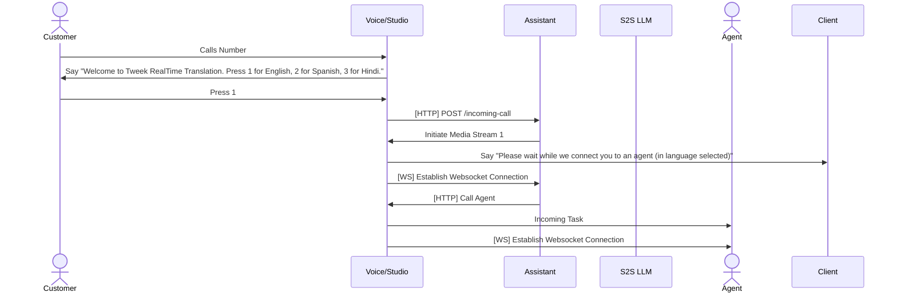

# Tweek RealTime Translation with AI Assistants

## Local Setup

1) Get invited to the `Tweek Project - RealTime Translator` or setup a Flex account yourself.
2) Clone the repository
3) `npm install`
4) `cp .env.sample .env` and update the parameters. The sample file has all the `Tweek Project - RealTime Translator` - you will only need the authToken and openAI Token

Then, run the dev server:
`npm run dev`
## Diagram

The eventual flow of the application is as follows. 
- In this diagram, `Voice/Studio` has colloquially been used to represent the Twilio Voice and Studio.
- The `Agent` represents the human agent who will be connected to the call via Twilio Flex.

